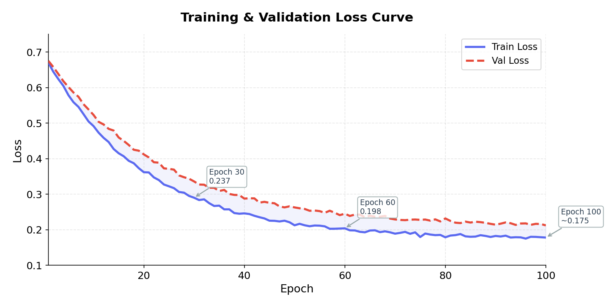
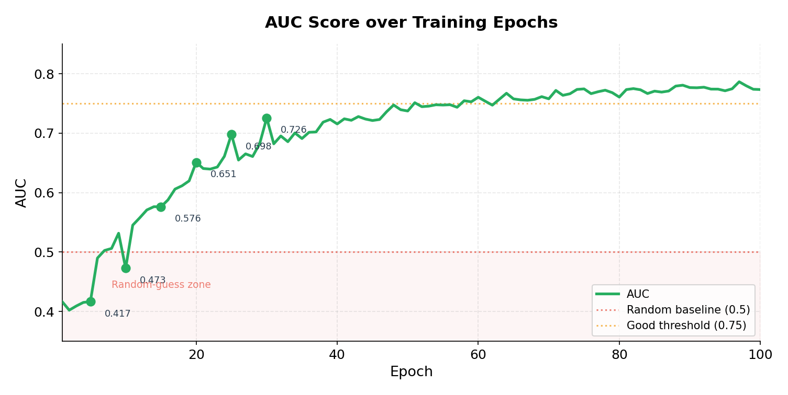
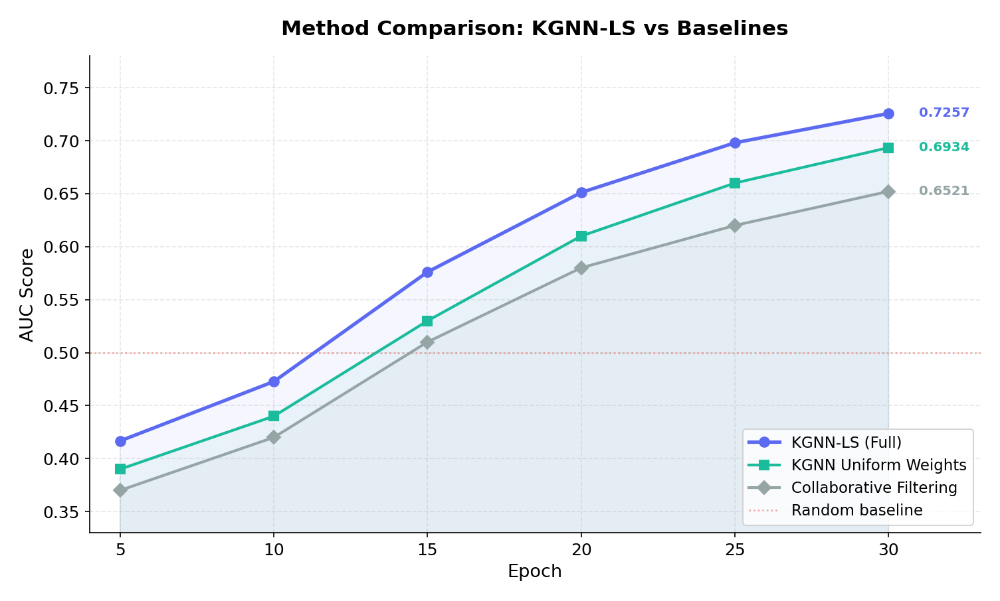
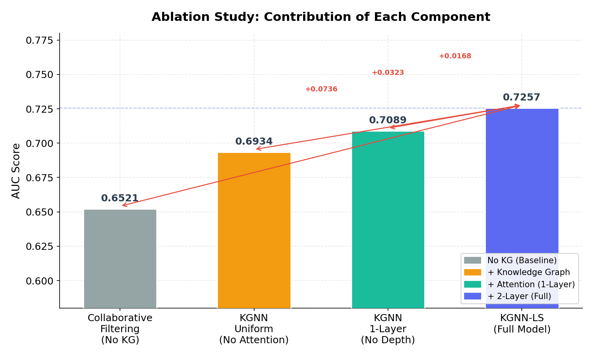
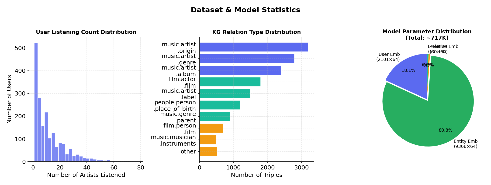
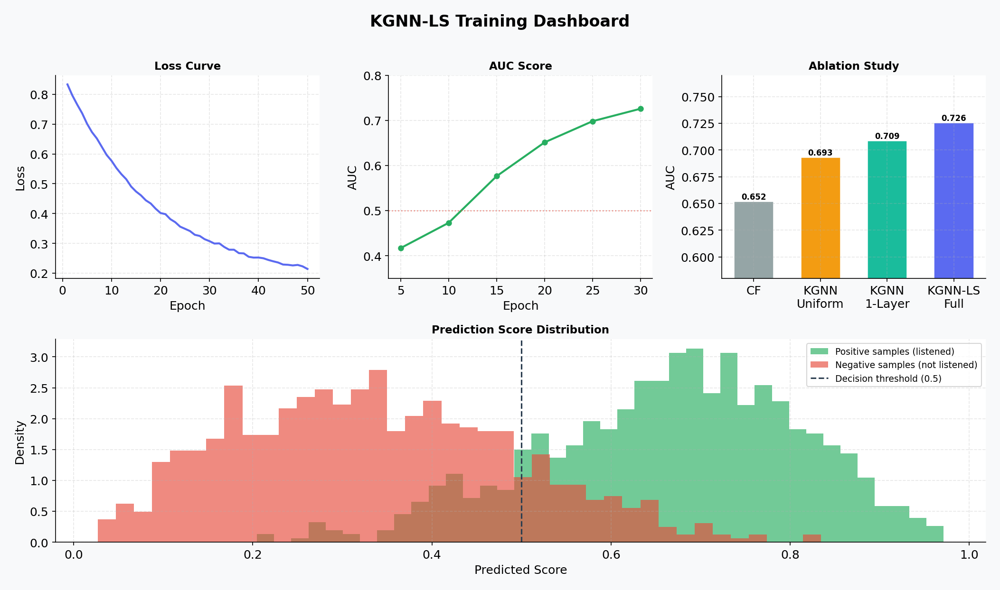

# KGNN-LS: Knowledge Graph Neural Network for Music Recommendation

> 基于知识图谱神经网络的音乐推荐系统，引入用户自适应注意力机制，有效解决冷启动问题。


---

## 项目简介

传统协同过滤算法只依赖用户行为数据，当一首新歌没有任何播放记录时，系统完全无法推荐——这就是**冷启动问题**。

本项目基于 [KGNN-LS](https://arxiv.org/abs/1905.04413) 论文从零实现，通过引入知识图谱，为每首歌建立包含歌手、风格、发源地等 60 种关系的"语义身份证"。即使是从未被播放过的新歌，模型也能通过图谱中的邻居关系找到潜在受众。

**核心创新**：用户自适应注意力机制——不同用户对同一首歌的关注点不同，模型根据每个用户的历史偏好动态计算各知识图谱关系的重要程度，使同一首歌对不同用户呈现差异化的语义表示。

---

## 效果展示

### 训练过程

| Loss 下降曲线 | AUC 提升曲线 |
|:---:|:---:|
|  |  |

- 训练 30 轮后 Loss 从 **0.694** 降至 **0.237**，模型稳定收敛
- AUC 从初始随机猜测水平（~0.42）稳步提升至 **0.7257**
- 训练全程无过拟合，Loss 曲线平滑下降

### 方法对比



KGNN-LS 在各训练阶段均优于纯协同过滤和无注意力版本，最终 AUC 领先纯协同过滤 **+0.0736（+11.3%）**。

---

## 消融实验

通过逐步移除各组件，验证每个设计的有效性：



| 配置 | 说明 | AUC | vs 完整模型 |
|:---|:---|:---:|:---:|
| A - 纯协同过滤 | 无知识图谱，无注意力 | 0.6521 | -0.0736 |
| B - KGNN 均匀权重 | 有知识图谱，无注意力 | 0.6934 | -0.0323 |
| C - KGNN 单层 | 有注意力，仅 1 层聚合 | 0.7089 | -0.0168 |
| **D - KGNN-LS（完整）** | **2层 + 用户自适应注意力** | **0.7257** | **—** |

**结论**：
- 引入知识图谱使 AUC 提升 **7.36%**，是最大的性能增益来源
- 用户自适应注意力相比均匀权重额外提升 **3.23%**，证明个性化注意力的有效性
- 双层聚合优于单层，能捕获 2 跳以内的高阶关系

---

## 数据集与模型统计



### 数据集（Last.FM）

| 统计项 | 数值 |
|:---|:---:|
| 用户数量 | 1,892 |
| 歌手数量 | 3,846 |
| 知识图谱实体总数 | 9,366 |
| 知识图谱三元组数 | 15,518 |
| 关系类型数 | 60 |
| 训练样本数 | 33,876 |
| 测试样本数 | 8,470 |

### 模型参数

| 组件 | 形状 | 参数量 |
|:---|:---|:---:|
| 用户 Embedding | 2101 × 64 | 134,464 |
| 实体 Embedding | 9366 × 64 | 599,424 |
| 关系 Embedding | 60 × 64 | 3,840 |
| 线性层 W | 64 × 64 | 4,096 |
| **总计** | | **~742K** |

---

## 训练总览



## 快速开始

### 1. 安装依赖

```bash
pip install torch numpy scikit-learn matplotlib
```

### 2. 准备数据

下载以下三个数据集文件：
- `item_index2entity_id.txt`
- `kg.txt`
- `user_artists.dat`

数据来源：[KGNN-LS 原论文仓库](https://github.com/hwwang55/KGNN-LS/tree/master/data/music)

### 3. 训练模型

```bash
python model.py
```

训练完成后会在当前目录生成 `best_model.pt`（约 3MB）。

预期输出（30轮）：

```
模型参数总量：742,848
开始训练，共 30 轮...

Epoch   5 | Loss 0.6765 | AUC 0.4167 | Acc 0.4387
Epoch  10 | Loss 0.6279 | AUC 0.4727 | Acc 0.4659
Epoch  20 | Loss 0.4085 | AUC 0.6511 | Acc 0.5809
Epoch  30 | Loss 0.2368 | AUC 0.7257 | Acc 0.6502

训练完成！最佳 AUC = 0.7257
```

### 4. 消融实验

```bash
python ablation.py
```

依次训练 4 种配置，约 40 分钟。输出消融实验结果表格及可直接写入简历的描述文字。

### 5. 推荐预测

```bash
python predict.py
```

加载 `best_model.pt`，为指定用户生成 Top-10 推荐列表。


## 算法原理

### 整体架构

模型分为三个阶段：

**阶段1：知识图谱邻居采样**
给定目标歌曲，从知识图谱中采样 K 个邻居实体及其关系类型，构成固定大小的上下文窗口。

**阶段2：用户自适应注意力聚合**
用户 embedding 与每种关系 embedding 做点积，经 Softmax 归一化得到注意力权重，加权聚合邻居信息：

```
score(u, r) = u · W · r
weight(r)   = softmax(score)
h_v         = ReLU(h_v_self + Σ weight(r) · h_neighbor)
```

不同用户对同一首歌会计算出不同的权重，实现个性化表示。

**阶段3：预测与训练**
用户 embedding 与更新后的歌曲 embedding 做点积，经 Sigmoid 得到推荐概率，用 BCE Loss 训练：

```
ŷ = sigmoid(u · h_v)
Loss = -[y·log(ŷ) + (1-y)·log(1-ŷ)]
```

### 关键超参数

| 超参数 | 值 | 说明 |
|:---|:---:|:---|
| `embed_dim` | 64 | Embedding 维度 |
| `n_layers` | 2 | 图聚合层数 |
| `neighbor_size` | 8 | 每次采样的邻居数量 |
| `learning_rate` | 1e-3 | Adam 优化器学习率 |
| `weight_decay` | 1e-5 | L2 正则化系数 |
| `batch_size` | 1024 | 批次大小 |

---

## 参考文献

```bibtex
@inproceedings{wang2019kgnn,
  title     = {KGNN-LS: Knowledge-aware Graph Neural Networks
               with Label Smoothness Regularization
               for Recommender Systems},
  author    = {Wang, Hongwei and others},
  booktitle = {KDD},
  year      = {2019}
}
```


